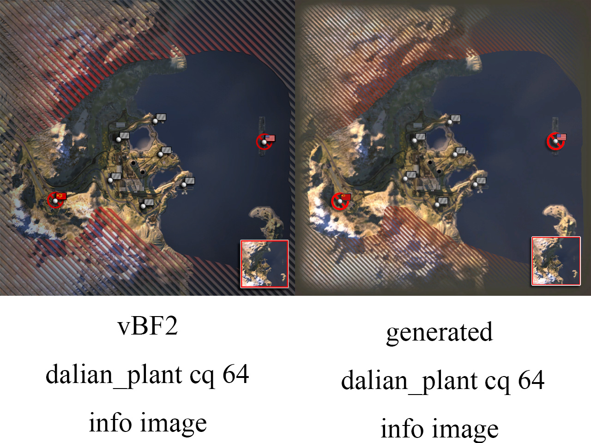

# bf2-infomap-generator
vBF2 style & BF2142 style info map generater V1.1 by worldlife(worldlife123)

This is a simple tool to generate vBF2 style and BF2142 style info images for your customized levels.

# Dependencies  

[Python 2.7.13](https://www.python.org/downloads/release/python-2713/)  
[Pillow](https://github.com/python-pillow/Pillow)  
[nvdxt.exe in NVIDIA DDS Utilities](https://developer.nvidia.com/legacy-texture-tools)

# Install  

1. Install [python 2.7.13](https://www.python.org/downloads/release/python-2713/) first. After installing python, you can run install_pillow.bat to install pillow via pip.  
2. Unzip the folder infomap into your mod's python folder. Note that this tool is not loaded in game, so after infomap generation you can delete the folder.   
3. Copy nvdxt.exe to bin folder.  

# Usage  

Run generateInfomaps.py with python.exe, or use run.bat. It will list all maps in your mod. Type a map name to generate info map for it, or Type "all" to generate for all maps.  
For BF2142, run generateInfomaps_2142.py with python.exe, or use run_2142.bat.  
Requirement for levels: The levels must be unzipped(that's to say, can be loaded in BF2Editor).The info ,Hud and Gamemodes folder must be present, as well as Init.con and Heightdata.con.  

# Customize  

1. Add a team to generate infomap flags.  
I've included all vBF2 and xpack teams in this tool. If you have custom team in the map, do the following:  
(1) In maps\flags, create a folder whose name is your custom team name.  
(2) Create a miniMap_CP.tga in this folder with your team's flag. A .psd template(created in Adobe Photoshop CS6) is provided inside maps\flags. You can use this as a reference.  
(3) Run the tool.  
For BF2142, look into maps\flags_2142.  

2. Use a custom cover to the infomap(such as a grid or your logo).  
In maps\areas, modify or replace a cover.dds. This image would be pasted on top of the generated info maps.  
For BF2142, look into maps\areas_2142.  

3. Use custom combat area.  
Similar to 2. Just modify or replace CombatArea.dds in maps\areas.  

# Credits 

* NVIDIA - for nvdxt.exe  
* fire&bf2tech.org - for conParser.py  
* Dnamro - for testing this tool  
